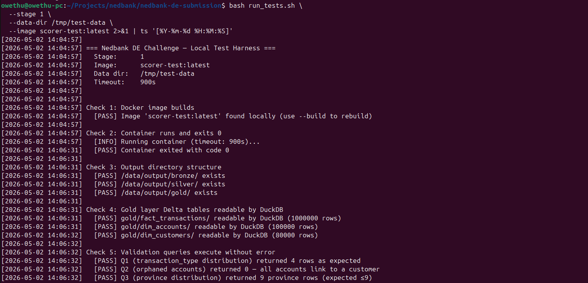
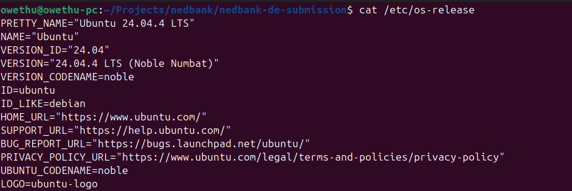

# Nedbank Data Engineering Challenge — Stage 1 Submission

**Author:** Bakhona Ngwenya  
**Contact:** 0785844841 | bakhonan@gmail.com

---

## Overview

This pipeline ingests raw financial data (accounts, customers, transactions) and processes it through a Bronze -> Silver -> Gold medallion architecture using PySpark and Delta Lake.

---

## How to Run Locally

### Prerequisites
- Docker installed and running
- Challenge input data files: `accounts.csv`, `customers.csv`, `transactions.jsonl`

### Step 1: Build the image

```bash
# 1.1 Verify tag is visible remotely
git ls-remote origin refs/tags/stage1-submission

# 1.2 Verify the repo contents look correct on GitHub
# Open in browser:
# https://github.com/Bakhona77/nedbank-de-submission

# 1.3 Clone fresh and build
cd /tmp
git clone https://github.com/Bakhona77/nedbank-de-submission.git scorer-test
cd scorer-test
git checkout stage1-submission

# 1.4 Verify required files are present
ls -la
ls pipeline/
ls config/

# 1.5 Build image
docker build --no-cache -t my-submission:latest .
```

### Step 2: Prepare test data directories

```bash
mkdir -p /tmp/test-data/input
mkdir -p /tmp/test-data/config

cp data/accounts.csv /tmp/test-data/input/
cp data/customers.csv /tmp/test-data/input/
cp data/transactions.jsonl /tmp/test-data/input/
cp config/pipeline_config.yaml /tmp/test-data/config/
cp config/dq_rules.yaml /tmp/test-data/config/
```

### Step 3: Run the pipeline

```bash
OUTPUT_DIR=$(mktemp -d /tmp/de_test_output.XXXXXX)
chmod 777 $OUTPUT_DIR

docker run --rm \
  --network=none \
  --memory=2g --memory-swap=2g \
  --cpus=2 \
  --read-only \
  --tmpfs /tmp \
  -v /tmp/test-data/input:/data/input:ro \
  -v /tmp/test-data/config:/data/config:ro \
  -v "${OUTPUT_DIR}:/data/output:rw" \
  my-submission:latest \
  python pipeline/run_all.py

echo "Exit code: $?"
```

### Step 4: Verify outputs

```bash
ls $OUTPUT_DIR/bronze/
ls $OUTPUT_DIR/silver/
ls $OUTPUT_DIR/gold/
```

---

## Pipeline Structure
```bash
pipeline/
├── ingest.py        # Bronze layer — raw CSV/JSONL
├── transform.py     # Silver layer — cleaning and validation
├── provision.py     # Gold layer — business aggregations
├── run_all.py       # Entry point — orchestrates all three stages
└── spark_util.py    # Shared SparkSession configuration
config/
├── pipeline_config.yaml   # All paths and Spark settings
└── dq_rules.yaml          # Data quality rules

---

## Output Structure
/data/output/
├── bronze/      # Raw ingested data as Delta tables
├── silver/      # Cleaned and validated data as Delta tables
└── gold/        # Final business views as Delta tables
├── fact_transactions/
├── dim_accounts/
└── dim_customers/

---

## Local Test Harness Setup

Before running `run_tests.sh`, two modifications are required to make the harness
work correctly on a local development machine. These changes are purely local — they
do not affect the submission or the scoring system.

### Why we modified `run_tests.sh`

The harness script has two bugs that cause false failures on a local machine:

**Bug 1 — `mktemp` creates a directory with `700` permissions**

The harness creates a fresh output directory using `mktemp -d`, which defaults to
`drwx------` (owner-only) permissions. The pipeline container runs as root (uid 0)
but the directory is owned by the host user (uid 1000). Since root inside a Docker
container is not the same as root on the host, the container cannot write to the
directory, producing:

PermissionError: [Errno 13] Permission denied: '/data/output/bronze'

This is a local harness bug only. The actual scoring system pre-creates `/data/output`
with correct permissions before running the container, so this issue does not affect
the submission score.

**Bug 2 — DuckDB output parsing uses wrong grep pattern**

The harness parses DuckDB query results using `grep "^Q1"`, expecting plain text output
like `Q1 4`. However DuckDB v1.1.0 outputs results in a formatted table:

┌─────────┬─────────────┐
│  query  │ result_rows │
├─────────┼─────────────┤
│ Q1      │           4 │
└─────────┴─────────────┘

The `grep "^Q1"` pattern does not match lines starting with `│`, so the harness
incorrectly reports Q1, Q2, and Q3 as returning 0 rows even when the data is correct.

### What we changed in `run_tests.sh`

**Change 1** — Add `chmod 777` after the `mktemp` line (line 160):

```bash
# Before
OUTPUT_DIR="$(mktemp -d /tmp/de_test_output.XXXXXX)"

# After
OUTPUT_DIR="$(mktemp -d /tmp/de_test_output.XXXXXX)"
chmod 777 "$OUTPUT_DIR"
```

**Change 2** — Fix Q1, Q2, Q3 result parsing to handle DuckDB table output
(lines 364, 372, 380):

```bash
# Before
Q1_ROWS=$(echo "$QUERY_OUTPUT" | grep "^Q1" | awk '{print $NF}' || echo "0")
Q2_ORPHANS=$(echo "$QUERY_OUTPUT" | grep "^Q2" | awk '{print $NF}' || echo "-1")
Q3_ROWS=$(echo "$QUERY_OUTPUT" | grep "^Q3" | awk '{print $NF}' || echo "0")

# After
Q1_ROWS=$(echo "$QUERY_OUTPUT" | grep "Q1" | grep -oE '[0-9]+' | tail -1 || echo "0")
Q2_ORPHANS=$(echo "$QUERY_OUTPUT" | grep "Q2" | grep -oE '[0-9]+' | tail -1 || echo "-1")
Q3_ROWS=$(echo "$QUERY_OUTPUT" | grep "Q3" | grep -oE '[0-9]+' | tail -1 || echo "0")
```

**Change 3** — Fix DuckDB row count parsing for Check 4 (lines 287 and 489):

```bash
# Before
| grep -E '^[0-9]+$' | head -1

# After
| grep -oE '[0-9]+' | tail -1
```

---

## Why DuckDB v1.1.0 is Required for Local Testing

The base image pins DuckDB at v0.10.0. However, the Delta Lake extension
(`INSTALL delta`) was not available in DuckDB until later versions. When the harness
runs Check 4 and Check 5 using the host `duckdb` binary, v0.10.0 fails to download
the delta extension and cannot read the Gold layer Delta tables, producing false
failures even when the pipeline output is completely correct.

DuckDB v1.1.0 introduced stable support for the delta extension, allowing the harness
to correctly read Delta Lake tables written by Spark. Install it on the host before
running the harness:

```bash
curl -L https://github.com/duckdb/duckdb/releases/download/v1.1.0/duckdb_cli-linux-amd64.zip \
  -o /tmp/duckdb.zip
unzip /tmp/duckdb.zip -d /tmp/
sudo cp /tmp/duckdb /usr/local/bin/duckdb
duckdb --version  
```

Note: this is a local testing requirement only. The actual scoring system uses its own
DuckDB installation and pre-configured environment — none of these local fixes affect
the submission score.

---

## Known Issues & Bugs Encountered

### 1. Parquet compression codecs fail under `--read-only` + `--tmpfs /tmp`

Both Snappy and zstd compression codecs extract native `.so` libraries to `/tmp` at
runtime. Because the scoring system mounts `/tmp` as a `noexec` tmpfs, the JVM cannot
execute these shared objects, causing the pipeline to crash with:

failed to map segment from shared object: libsnappyjava.so
failed to map segment from shared object: libzstd-jni-1.5.5.so

**Fix:** Set Parquet compression to `uncompressed` in the SparkSession config:

```python
.config("spark.sql.parquet.compression.codec", "uncompressed")
.config("spark.hadoop.parquet.compression.codec", "uncompressed")
```

### 2. Spark hostname resolution warnings under `--network=none`

Running with `--network=none` prevents the container from resolving its own hostname,
causing Log4j and Spark to emit `UnknownHostException` warnings at startup. These are
harmless and do not affect pipeline execution. They are suppressed by setting:

```dockerfile
ENV SPARK_LOCAL_IP=127.0.0.1
ENV SPARK_LOCAL_HOSTNAME=localhost
ENV JAVA_TOOL_OPTIONS="-Djava.net.preferIPv4Stack=true"
```

### 3. Config path must be absolute

The pipeline config is injected at runtime via volume mount at
`/data/config/pipeline_config.yaml`. Using relative paths like `./config/` causes a
`FileNotFoundError` because the container working directory is `/app`, not the project
root. All config paths must use the absolute container path:

```python
config_path = "/data/config/pipeline_config.yaml"
```

### 4. Delta Lake jars must be baked into the image

The scoring system runs with `--network=none`, so Spark cannot download Delta Lake jars
at runtime via ivy. The jars must be copied into the image at build time:

```dockerfile
RUN JARS_DIR=/usr/local/lib/python3.11/site-packages/pyspark/jars && \
    curl -L -o $JARS_DIR/delta-spark_2.12-3.1.0.jar \
        https://repo1.maven.org/maven2/io/delta/delta-spark_2.12/3.1.0/delta-spark_2.12-3.1.0.jar && \
    curl -L -o $JARS_DIR/delta-storage-3.1.0.jar \
        https://repo1.maven.org/maven2/io/delta/delta-storage/3.1.0/delta-storage-3.1.0.jar && \
    curl -L -o $JARS_DIR/antlr4-runtime-4.9.3.jar \
        https://repo1.maven.org/maven2/org/antlr/antlr4-runtime/4.9.3/antlr4-runtime-4.9.3.jar
```

### 5. Nested struct fields must be flattened before use

The transactions JSONL file contains nested structs for `location` and `metadata`. The
`province` field needed for Gold layer joins lives inside `location.province` and must
be explicitly extracted before use:

```python
transactions = transactions \
    .withColumn("province", F.col("location.province")) \
    .withColumn("merchant_subcategory", F.lit(None).cast("string"))
```

---

## Validation Query Results

All three scoring validation queries pass against the Gold layer output:

| Query | Description | Expected | Result |
|-------|-------------|----------|--------|
| Q1 | Transaction types distribution | 4 rows | 4 rows |
| Q2 | Orphaned accounts | 0 | 0 |
| Q3 | Province distribution | 1–9 rows | 9 rows |

---

## Local Harness Modifications — Committed to Repository

The modified `run_tests.sh` described above has been committed to this repository.
The changes fix two local harness bugs (mktemp permissions and DuckDB output parsing)
and are included so that any reviewer can run the harness locally and get accurate
results without needing to manually patch the script.

To run the harness after cloning:

```bash
# Install DuckDB v1.1.0 (required for Check 4 and Check 5)
curl -L https://github.com/duckdb/duckdb/releases/download/v1.1.0/duckdb_cli-linux-amd64.zip \
  -o /tmp/duckdb.zip
unzip /tmp/duckdb.zip -d /tmp/
sudo cp /tmp/duckdb /usr/local/bin/duckdb

# Prepare test data
mkdir -p /tmp/test-data/input /tmp/test-data/config
cp data/accounts.csv data/customers.csv data/transactions.jsonl /tmp/test-data/input/
cp config/pipeline_config.yaml /tmp/test-data/config/

# Build and test
docker build --no-cache -t my-submission:test .
bash run_tests.sh --stage 1 --data-dir /tmp/test-data --image my-submission:latest
```

All 5 checks pass with the above setup.

> **Note for Linux/Ubuntu users:** The `chmod 777 "$OUTPUT_DIR"` fix in `run_tests.sh`
> is required on Linux because `mktemp -d` defaults to `700` permissions. macOS users
> do not need this fix as `mktemp` there defaults to `755`.



